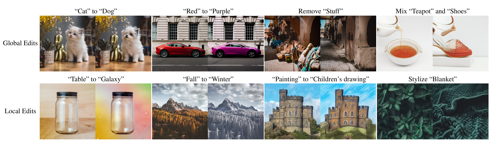

# :watermelon: MDP-Diffusion


**MDP: A Generalized Framework for Text-Guided Image Editing by Manipulating the Diffusion Path**<br>
Qian Wang, Biao Zhang, Michael Birsak, Peter Wonka <br>


[Project page](https://qianwangx.github.io/MDP-Diffusion/)

1. Create the conda enviroment
```
conda env create -f environment.yml
```
2. Play around with MDP.ipynb. We provide the implementation of MDP-epsilon_t.

